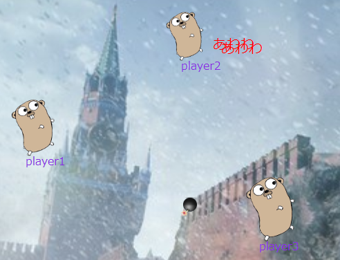
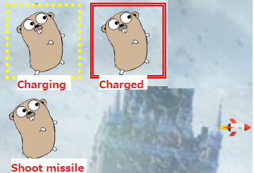

# Gopher War II

A real-time multiplayer shooting game built with Go backend and vanilla JavaScript frontend, featuring WebSocket-based communication for seamless gameplay.

## Features

- **Real-time multiplayer**: Multiple players can join and play simultaneously
- **Three unique characters**: Choose from Gopher, Sushidog, or Duke, each with distinct abilities
- **Dual weapon system**: Bombs (click) and missiles (hold & release)
- **WebSocket communication**: Low-latency real-time game state synchronization
- **Visual effects**: Explosions, death particles, and dynamic character sprites
- **Responsive design**: Browser-based gameplay with intuitive mouse controls

## Tech Stack

- **Backend**: Go with [Gin](https://gin-gonic.github.io/gin/) web framework
- **WebSocket**: [Melody](https://github.com/olahol/melody) library for real-time communication
- **Frontend**: Vanilla JavaScript with HTML5 Canvas-like DOM manipulation
- **Deployment**: Railway-ready with automatic HTTPS/WSS support

## Quick Start

### Prerequisites
- Go 1.19 or later
- Modern web browser

### Installation & Run

```bash
# Clone the repository
git clone <repository-url>
cd gopher-war-II

# Start the server
go run main.go

# Access the game
open http://localhost:5000
```

### Environment Variables

- `IP`: Set server IP address (default: localhost)
- `PORT`: Set server port (default: 5000, auto-set in PaaS environments)

Example:
```bash
IP=0.0.0.0 PORT=8080 go run main.go
```

## Screenshots

### Character Selection


### Missile Charging


## How to Play

### Controls
- **Movement**: Move your cursor to control your character
- **Fire Bomb**: Left click to shoot bombs
- **Fire Missile**: Hold left mouse button for 1+ seconds, then release to fire powerful missiles

### Characters
- **Gopher**: Fast but fragile, bomb-focused gameplay
- **Sushidog**: Balanced character with healing missiles
- **Duke**: Powerful but slow, high damage output

### Game Mechanics
- Players lose health when hit by weapons
- Character size decreases as health decreases
- Game over when health reaches zero
- Return to character selection after death

## Deployment

### Railway
This game is ready for deployment on Railway:

1. Connect your GitHub repository to Railway
2. Railway will automatically detect Go and deploy
3. Access your game at the provided Railway URL

### Other Platforms
Compatible with any Go-supporting PaaS platform (Heroku, Render, Fly.io, etc.)

## Development

### Project Structure
```
├── main.go              # Main server implementation
├── static/
│   ├── index.html       # Character selection screen
│   ├── game.html        # Game screen
│   └── {character}/     # Character-specific assets
└── screenshot/          # Documentation images
```

### WebSocket Protocol
The game uses text-based WebSocket messages for client-server communication:

**Client → Server:**
- `init {name} {character} {config}` - Player initialization
- `show {x} {y} {charge}` - Position updates
- `fire-bomb/fire-missile {x} {y} {direction}` - Weapon firing
- `refresh` - Game loop trigger

**Server → Client:**
- `appear {id}` - Player spawn
- `show {id} {x} {y} {life} {name} {charge} {character}` - Player state
- `bullet {id} {x} {y} {direction} {special} {character}` - Bullet updates
- `hit/miss/dead` - Combat events

## Contributing

1. Fork the repository
2. Create a feature branch
3. Make your changes
4. Test thoroughly
5. Submit a pull request

## License

This project is open source. Feel free to use and modify according to your needs.

## Acknowledgments

- Built with [Gin](https://gin-gonic.github.io/gin/) web framework
- WebSocket implementation using [Melody](https://github.com/olahol/melody)
- Inspired by classic multiplayer shooting games

